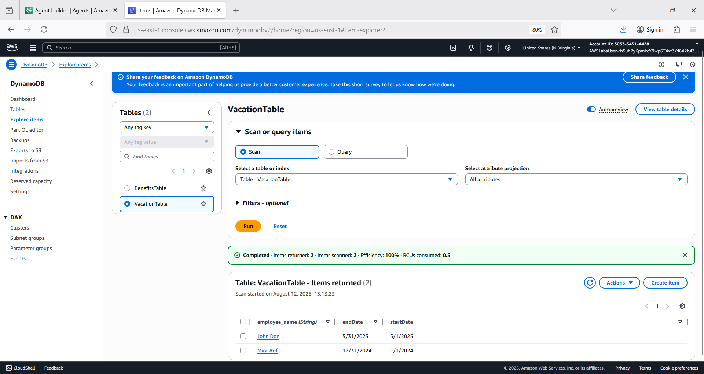

# smartai 👨‍🦼🛬
smartai : Smart AI Assistance # RAG # Bedrock # OpenSearch # Lambda

## Objective

- Create an AI Smart Assistant 
- Integrate/leverage assistant with Lambda, OpenSearch & DynamoDB
- Create Amazon Bedrock knowledge bases
- Create Bedrock agent to answer HR questions
- Create bedrock group action to submit vacation requests

## AI Smart Assistant

